# SƠ ĐỒ LUỒNG NGƯỜI DÙNG & QUY TRÌNH NGIỆM VỤ (USER FLOWS & WORKFLOW SPECIFICATION)
## DỰ ÁN: KIENPRO LMS

---

## 1. TỔNG QUAN LUỒNG KÍCH HOẠT TỰ ĐỘNG (END-TO-END AUTOMATED FLOW)

Quy trình cốt lõi của **KIENPRO LMS** là giúp người học mua khóa học và truy cập bài giảng một cách tự động 100%, không cần sự can thiệp thủ công của Admin nhưng vẫn đảm bảo tính an toàn, bảo mật tuyệt đối.

```mermaid
sequenceDiagram
    autonumber
    actor Learner as Học viên
    participant Web as KIENPRO Web UI
    participant Server as Next.js Server / API
    participant DB as Supabase PostgreSQL
    participant Gateway as Payment Gateway (SePay/PayOS)
    participant Email as Resend Email Service

    Learner->>Web: 1. Xem trang khóa học & Bấm "Đăng ký mua"
    Web->>Learner: 2. Hiển thị Form (Họ tên, Email, SĐT)
    Learner->>Web: 3. Gửi thông tin đăng ký
    Web->>Server: 4. POST /api/checkout (Zod validation)
    Server->>DB: 5. Tạo đơn hàng (Status: PENDING)
    Server-->>Web: 6. Trả về Mã QR Ngân hàng (VietQR + OrderCode)
    Web-->>Learner: 7. Hiển thị Mã QR & Hướng dẫn quét app Ngân hàng

    Learner->>Gateway: 8. Quét mã QR & Chuyển khoản tiền
    Gateway->>Server: 9. Gửi Webhook (POST /api/webhooks/payment)
    
    rect rgb(40, 40, 40)
        note over Server, DB: Xử lý Webhook & Idempotency Check
        Server->>DB: 10. Check unique (provider, transaction_id)
        alt Giao dịch trùng (Replay)
            Server-->>Gateway: Trả về HTTP 200 (Ignored - Already processed)
        else Giao dịch hợp lệ
            Server->>DB: 11. Cập nhật Status Đơn hàng = PAID
            Server->>DB: 12. Tìm hoặc Tạo Profile theo Email
            Server->>DB: 13. Tạo bản ghi Enrollment (Cấp quyền học)
            Server->>DB: 14. Tạo Activation Token (Hạn 72h)
            Server->>Email: 15. Trigger gửi Email kích hoạt
        end
    end

    Email-->>Learner: 16. Nhận Email "Kích hoạt tài khoản KIENPRO LMS"
    Learner->>Web: 17. Click Link kích hoạt (kèm Token)
    Web->>Server: 18. Xác thực Token còn hạn
    Web-->>Learner: 19. Giao diện Đặt mật khẩu lần đầu
    Learner->>Web: 20. Nhập Mật khẩu mới & Xác nhận
    Web->>Server: 21. Cập nhật Mật khẩu (Supabase Auth) & Invalidate Token
    Server-->>Web: 22. Tự động Đăng nhập & Chuyển tới Dashboard Học tập
```



---

## 2. CHI TIẾT TỪNG BƯỚC TRONG LUỒNG NGƯỜI DÙNG

### Bước 1 & 2: Đăng ký Mua khóa học & Điền Thông tin
- Học viên vào trang Landing Page của Khóa học (ví dụ: `/courses/thiet-ke-website-ai`).
- Học viên xem thông tin khóa học, bấm nút **"Đăng ký ngay"**.
- Màn hình hiển thị Form đăng ký tối giản:
  - **Họ và tên** (Bắt buộc)
  - **Email** (Bắt buộc - Kiểm tra định dạng Email chính xác)
  - **Số điện thoại / Zalo** (Bắt buộc - Dùng để hỗ trợ khi gõ sai email)
  - **Mã giảm giá / Voucher** (Nếu có)

### Bước 3 & 4: Tạo Đơn hàng (Order Creation)
- Server nhận request `POST /api/checkout`, thực hiện Zod validation:
  - Kiểm tra xem khóa học có tồn tại và đang xuất bản (`status = 'published'`).
  - Tính toán tổng tiền (Giá gốc - Mã giảm giá).
  - Sinh **Order Code** ngẫu nhiên duy nhất (Ví dụ: `KP98241`).
- Lưu bản ghi vào bảng `orders` với trạng thái `PENDING`.
- Lưu thông tin chi tiết vào bảng `order_items`.

### Bước 5 & 6: Hiển thị QR Thanh toán Ngân hàng (VietQR Instant Display)
- Giao diện chuyển sang màn hình Thanh toán Đơn hàng (`/checkout/pay/[orderId]`).
- Hiển thị QR Code ngân hàng tự động sinh qua VietQR API:
  - **Ngân hàng**: Techcombank / MBBank...
  - **Số tài khoản**: Số tài khoản cửa hàng Kiên Pro.
  - **Chủ tài khoản**: KIEN PRO
  - **Số tiền**: Chính xác theo đơn hàng.
  - **Nội dung chuyển khoản**: `KP98241` (Chính là Order Code).
- **Bộ đếm thời gian (Countdown Timer)**: 15 phút.
- **Cơ chế Real-time Polling / Supabase Realtime**: Màn hình lắng nghe sự thay đổi trạng thái của `orders.status`. Khi nhận được webhook thanh toán thành công, màn hình tự động chuyển sang thông báo *"Thanh toán thành công! Vui lòng kiểm tra Email để kích hoạt tài khoản"*.

### Bước 7 & 8: Nhận Webhook & Cơ chế Chống trùng (Anti-replay Idempotency)
- Webhook nhận tại API Route `POST /api/webhooks/payment`.
- **Bước 8.1 - Verification**: Kiểm tra HMAC Signature hoặc Header Secret Key từ provider (SePay/PayOS/Casso). Trả lỗi `401 Unauthorized` nếu sai chữ ký.
- **Bước 8.2 - Idempotency Lock**: Tra cứu bảng `webhook_events` theo `(provider, transaction_id)`:
  - Nếu đã tồn tại -> Trả lời ngay HTTP `200 OK` (Bỏ qua xử lý lại).
  - Nếu chưa -> Tạo bản ghi `webhook_events` với trạng thái `PROCESSING`.
- **Bước 8.3 - Đối soát Đơn hàng**:
  - Trích xuất Order Code trong nội dung chuyển khoản (`KP98241`).
  - Kiểm tra số tiền nhận được `>= orders.total_amount`.
  - Cập nhật `orders.status = 'PAID'` và tạo bản ghi `payments`.

### Bước 9 & 10: Xử lý Tài khoản & Cấp khóa học (Provisioning)
- Kiểm tra Email khách mua trong bảng `profiles`:
  - **Trường hợp A (Khách hàng mới)**:
    1. Tạo User trong Supabase Auth (dùng email, mật khẩu tạm thời ngẫu nhiên cực dài không ai biết).
    2. Tạo bản ghi `profiles` tương ứng.
    3. Tạo bản ghi `activation_tokens` (Token ngẫu nhiên `crypto.randomUUID()`, hết hạn sau 72 giờ).
    4. Trạng thái profile: `is_activated = false`.
  - **Trường hợp B (Khách hàng đã có tài khoản)**:
    1. Tìm thấy `profile_id` sẵn có.
    2. Không cần tạo token kích hoạt mới (hoặc gửi email thông báo "Khóa học mới đã được thêm vào tài khoản của bạn").
- **Tạo bản ghi `enrollments`**:
  - `user_id`: UUID học viên.
  - `course_id`: UUID khóa học.
  - `status`: `ACTIVE`.
  - `enrolled_at`: `NOW()`.

### Bước 11: Gửi Email Kích hoạt qua Resend API
- Gọi Resend API gửi email mẫu HTML Premium (Gold/Dark):
  - **Tiêu đề**: `[KIENPRO LMS] Kích hoạt tài khoản & Truy cập khóa học: {Course Name}`
  - **Nội dung**: Lời chào cá nhân hóa, nút bấm `KÍCH HOẠT TÀI KHOẢN NGAY`.
  - **URL Nút bấm**: `https://lms.kienpro.com/activate?token={ACTIVATION_TOKEN}`

### Bước 12 & 13: Học viên Thiết lập Mật khẩu Lần đầu
- Học viên bấm vào Link từ Email.
- Hệ thống gọi API xác minh `activation_tokens`:
  - Nếu hết hạn hoặc không hợp lệ -> Hiển thị màn hình lỗi và nút *"Yêu cầu gửi lại link kích hoạt"*.
  - Nếu hợp lệ -> Hiển thị form: **Đặt mật khẩu mới** (Tối thiểu 8 ký tự, có chữ & số).
- Học viên bấm **"Hoàn tất kích hoạt"**:
  - Cập nhật mật khẩu chính thức vào Supabase Auth.
  - Đánh dấu `is_activated = true` trong `profiles`.
  - Đánh dấu `used_at = NOW()` trong `activation_tokens`.

### Bước 14: Đăng nhập & Bắt đầu Học tập
- Tự động đăng nhập học viên (Session token).
- Redirect trực tiếp tới trang Học tập của Khóa học (`/learn/{course-slug}`).
- Màn hình học hiển thị danh sách Module, Bài giảng video, Tài liệu đính kèm và Thanh tiến độ hoàn thành.

---

## 3. TRẠNG THÁI CÁC ĐỐI TƯỢNG (STATE TRANSITION DIAGRAMS)

### 3.1 Vòng đời Đơn hàng (`orders.status`)
```
[PENDING] ---> (Nhận Webhook đủ tiền) ---> [PAID] ---> (Hoàn tất provisioning) ---> [COMPLETED]
   |
   +---------> (Quá 15p không trả tiền) --> [EXPIRED]
   |
   +---------> (Khách hủy / Admin hủy) --> [CANCELLED]
   |
   +---------> (Admin hoàn tiền) --------> [REFUNDED]
```

### 3.2 Vòng đời Kích hoạt Tài khoản (`profiles.is_activated`)
```
[UNACTIVATED] ---> (Click link email & Đặt mật khẩu thành công) ---> [ACTIVATED]
```

### 3.3 Vòng đời Quyền học (`enrollments.status`)
```
[ACTIVE] <---> (Khóa tạm thời do nghi ngờ share acc) <---> [SUSPENDED]
   |
   +---------> (Hủy do hoàn tiền) -----------------------> [REVOKED]
   |
   +---------> (Hết hạn hợp đồng - nếu có) --------------> [EXPIRED]
```
